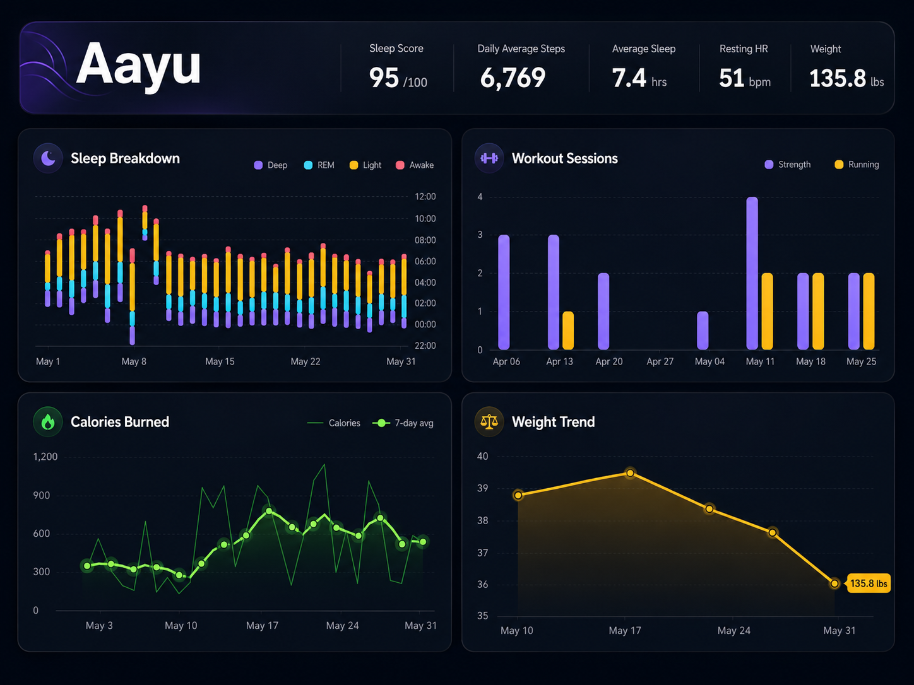

# Aayu — Personal Health Dashboard

A Streamlit dashboard for wearable health data exported from the
**Zepp** app (Amazfit devices). Charts are built with Plotly.



At a glance: a KPI banner (sleep score, steps, sleep, resting HR, weight), a
month filter, and four charts — **Sleep Breakdown**, **Workout Sessions**,
**Calories Burned**, and **Weight Trend**.

## Setup

```bash
git clone <repo-url> && cd aayu
python3 -m venv .venv && source .venv/bin/activate
pip install -r requirements.txt
```

Export your data from the Zepp app and drop the folders into `data/` — one
`.csv` per folder:

```
data/
├── ACTIVITY/        ├── SLEEP/
├── BODY/            ├── SLEEP_MINUTE/
├── HEARTRATE_AUTO/  ├── SPORT/
└── USER/
```

## Run

```bash
streamlit run streamlit_app.py
```

Opens at http://localhost:8501. (Use `streamlit run`, not `python` — a plain
`python streamlit_app.py` won't serve the app.)

## Project Structure

```
streamlit_app.py    # entry point — the Streamlit view
core/               # framework-agnostic logic (no Streamlit)
  data.py           #   CSV loading, processing, KPI values
  charts.py         #   Plotly figure builders (one per chart)
  theme.py          #   colours + Plotly layout defaults
ui/                 # Streamlit view: styles.py (CSS), components.py
.streamlit/         # base theme config
```

## Data Privacy

`data/` is gitignored and never committed — your health data stays local.
